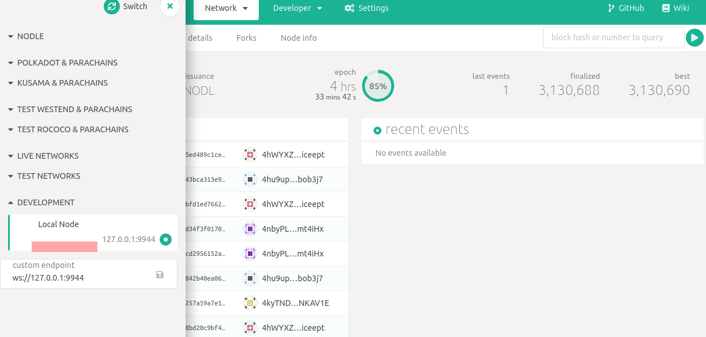

# nodle4stakers

Quick start utility scripts & guide to run nodle staker validator's node.

## Repo Overview

| Id | Scripts | Discp |
| --- | --- | --- |
| 1. | launch-validator-node.sh | Launch the Validator node |
| 2. | inject-session-key.sh | Inject the session key, allows the validator node to participate in block production |
| 3. | init-env.sh | Allows to configure user specific env parameters, script 1 & 2 internally use it. |

## Pre-Steps

1. Ensure Docker is installed.

2. Ensure nodle address planning to get added to validator pool, has enough nodle cash, minimum 5 nodle.

## Main-Steps

1, Ensure `init-env.sh` environments are configured, for example **OVERALL_SECRET** is updated to secret seed of validator address.

2, Run `./launch-validator-node.sh` - script launche's the nodle node (script uses docker runtime).

4, Launch browser & open web app `https://nodleprotocol.io/`, & choose `Local Node`

3, Let's wait for the node to get complete with storage sync.

4, Ensure no session keys for the validator adress.

4, Add validator address to staker's validator pool, and specify the validator bond value.

**Status Check**

5, Run `./inject-session-key.sh` - script inject's session key for the configured validator address.

**Status Check**

6, Wait for current session to get completed. your node will be selected as validator for the next new session, if your address is one among top-10 in staking value.
